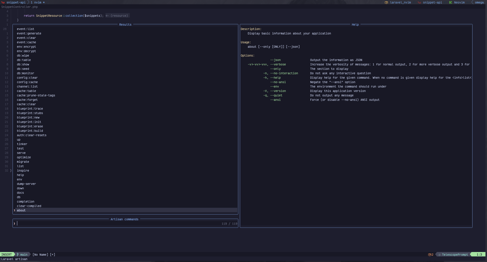
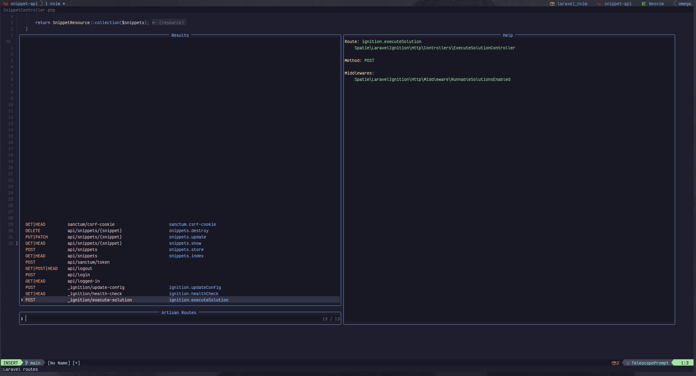
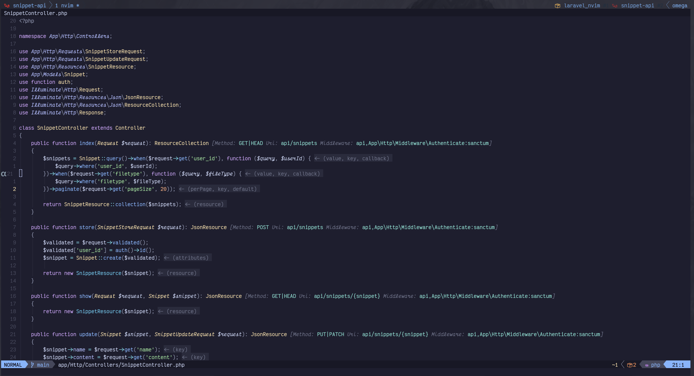
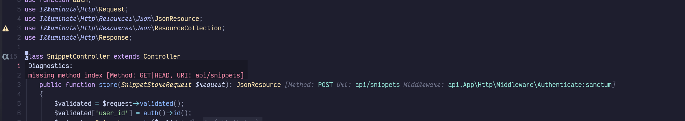

# Laravel.nvim
Plugin for Neovim to enhance the development experience of Laravel projects

Quick executing of artisan commands, list and navigate to routes. Information about the routes.
Robust API to allow you to run any command in the way that you need.

## Preview




## Requirements
Treesitter, LSP Server (I use and recommend [phpactor](https://github.com/phpactor/phpactor))
`fd` to look for files as migrations when are created
`rg` ripgrep to look usage of views

## Installation
Lazy
```lua
return {
  "adalessa/laravel.nvim",
  dependencies = {
    "nvim-telescope/telescope.nvim",
    "tpope/vim-dotenv",
    "MunifTanjim/nui.nvim",
  },
  cmd = { "Sail", "Artisan", "Composer", "Npm", "Yarn", "Laravel" },
  keys = {
    { "<leader>la", ":Laravel artisan<cr>" },
    { "<leader>lr", ":Laravel routes<cr>" },
    { "<leader>lm", ":Laravel related<cr>" },
  },
  event = { "VeryLazy" },
  config = true,
}
```
Dotenv is use to read environment variables from the `.env` file

For nicer notifications I recommend `rcarriga/nvim-notify`

My lazy configuration for notify is
```lua
return {
    "rcarriga/nvim-notify",
    config = function()
        local notify = require("notify")
        -- this for transparency
        notify.setup({ background_colour = "#000000" })
        -- this overwrites the vim notify function
        vim.notify = notify.notify
    end
}
```

## Config

Default [config]("./lua/laravel/config/default.lua"), this can be set on the `setup` function
In this config there are several secitions, like `lsp_server` which is use to interact with neovim lsp client to look for classes by the name.
Currently support `phpactor` and `intelephense` as far as I know there are no other php lsp sever.

By default the plugin register several commands like `Artisan` `Composer` `Npm` `Sail` `DockerCompose` `Yarn` and `Bun` if you don't want them you can use
`register_user_commands` and set it as `false`.


## Features
In adition to the selector for the commands, routes and api, you can use some extras features *Route Info* *Views Completion* *Routes Completion*
Route info can be seen in the above screenshots, this allows to see in the controller the route associated to it, and in case that is missing will
add a diagnostic error which indicate which method is missing.

This also will show error if a route is defined but the method is not defined


> Note: using lazy is likely that you will not see at first since the plugin will not load until you call one of the commands, after that it is just picked up

The completions uses `none-ls` which was previusly know as `null-ls`.
Views and Routes completion works as providing the list of the respective in the php files for the function `view` and `route`.

## UI
An important part of the plugin is how to show the results of the commands, for this I decide to use `nui` this allow to easily interact with split and popup
You can customize from the size and options. examples can be seen in the default [here](./lua/laravel/config/ui.lua)

## Command Options
Of course not all the commands want to be run in the same way. you can specify for example which `ui` to use, if should `skip_args`.
Can also set `nui_opts` to define how the ui should display.
Also can define options this is usefull for example for `make:model` you may want to always use the flags `-mf`
```lua
  ["make:model"] = { options = { "-mf" } },
```

## Resources
A main part when creating resources like controllers, models, etc you most likely want to open it. Since the laravel commands does not return what was created
I base on the type and and provided name to look for the file here is the list that can also be customize to add in case you have custom or from a plugin that
you use [resources](./lua/laravel/config/resources.lua)


# Environments
Running your laravel app has many forms, you can use something like *Laravel Herd* *Laravel Sail* *Docker Compose* or just the good `php artisan serve` this presents
a challange, a fundamental aspect you want to run the command where it should with sail, with in your docker or simple the php native executable.
In order to support this there is this [configuration](./lua/laravel/config/environments.lua)

Since you may not want the same configuration for all you projects you can use the env variable `NVIM_LARAVEL_ENV` define it in your `.env` file in your project.
If you don't se it by default will use auto_discover this will go over each definition and test base on the conditions, if they are meant will use that.
In case no configuration matches will try to use the default one.

For the docker compose one also you can use an env variable to define which container will be use to run the commands.

## Artisan
To run Artisan commands you can use `:Artisan` which will autocomplete with the available
artisan command as the terminal

Not sending any arguments will run the Telescope prompt

`:Artisan tinker` will open the terminal inside of Neovim, with tinker

Any other command will just run and output the result on a new split

## Sail
You can run `shell` as tinker will open a new terminal
`up`, `down`, `restart` will notify when starting and result will show as notification

## Composer
`install`, `update`, `require` and `remove` from the `:Composer` command

## Plugin specific
`Laravel cache:clear` purge the cache clears the cache for commands.
`Laravel commands` shows the list of artisan commands and executes it.
`Laravel routes` show the list of routes and goes to the implementation.
`Laravel related` show the list of model related classes, includes observers, policy and relations and goes to the implementation.
`Laravel test:watch` runs the application tests and keep monitoring the changes
`Laravel history` each command is recorded in case you want to run the same again
`Laravel view-finder` This will look for the views that are use in the file and if only one will go to it, in case of more will show a select, in the view will look for the class that uses it
`Laravel recipes` There are some recipes like installing ide helper and running the model and eloquent command. and to install doctrine dbal
`Laravel health` trigger the neovim command `:checkhealth laravel`

## Lua API
### Telescope
One of the things you may want to change are actions or styles or something related to telescope
The picker is `require("telescope").extensions.laravel.routes` so you can call it and pass the arguments as usual for telescope
the same for `commands`, `related` and `history`

### Run commands
You may want to run commands of course you can use `:Artisan my-command args` but you may want to pass nui options and more for that you can use
```lua
local run = require "laravel.run"
run("artisan", {"my-command"}, {})
```

This will be run in the nui, but you may want to do more plugins like and do something with the output
for that you can call the `api`

```lua
local api = require "laravel.api"
```
Here you can use the methods `sync` and `async` I recommend the use of async that will not block the editor but there are cases that you may want to use sync.
have in consideration that to avoid hanging the editor there is the default timeout from plenary
The response and the value for callback is [ApiResponse](./lua/laravel/api/response.lua)
If you will use them I recommend peek into the code sync I use them a lot as building block for the plugin.


# Self promotion
I am Ariel I am a developer and also content creator (mostly in Spanish) if you would like to show some love leave a start into the plugin and subscribe to my [Youtube](https://youtube.com/@Alpha_Dev) if you want to show even more love you can support becoming a member on Youtube. But just leaving a like or letting me know that you like and enjoy the plugin is appreciated.

# Collaboration
I am open to review pr if you have ideas or ways to improve the plugin would be great.
