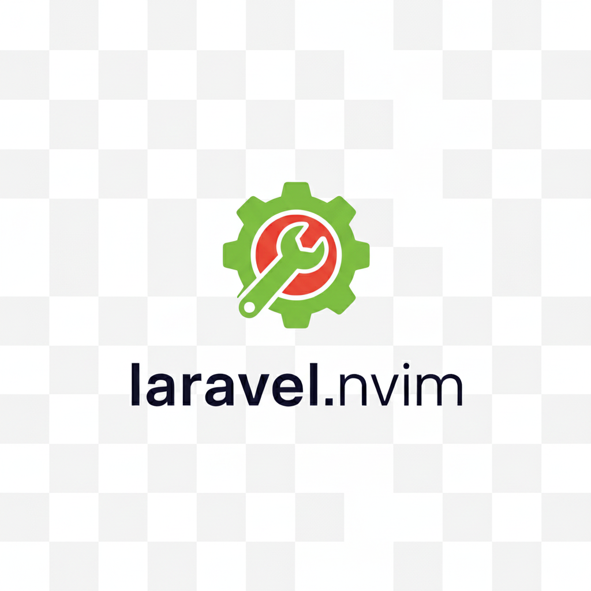
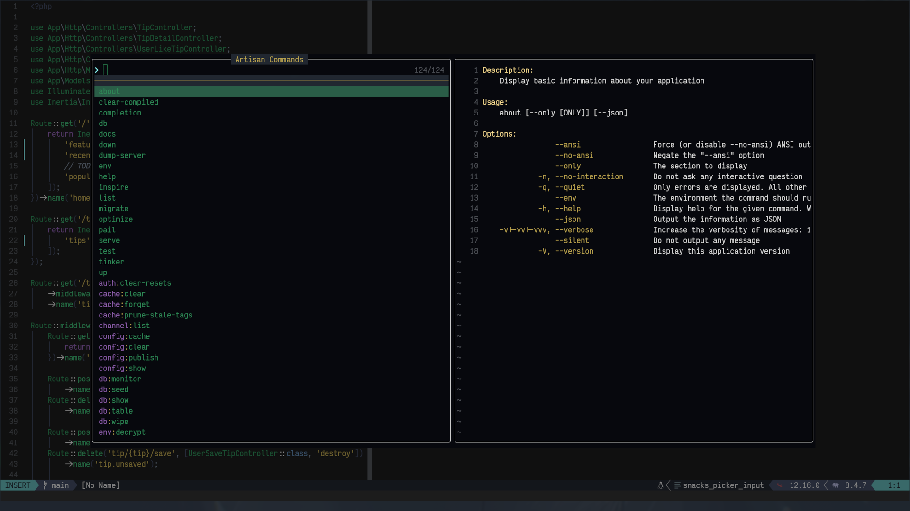
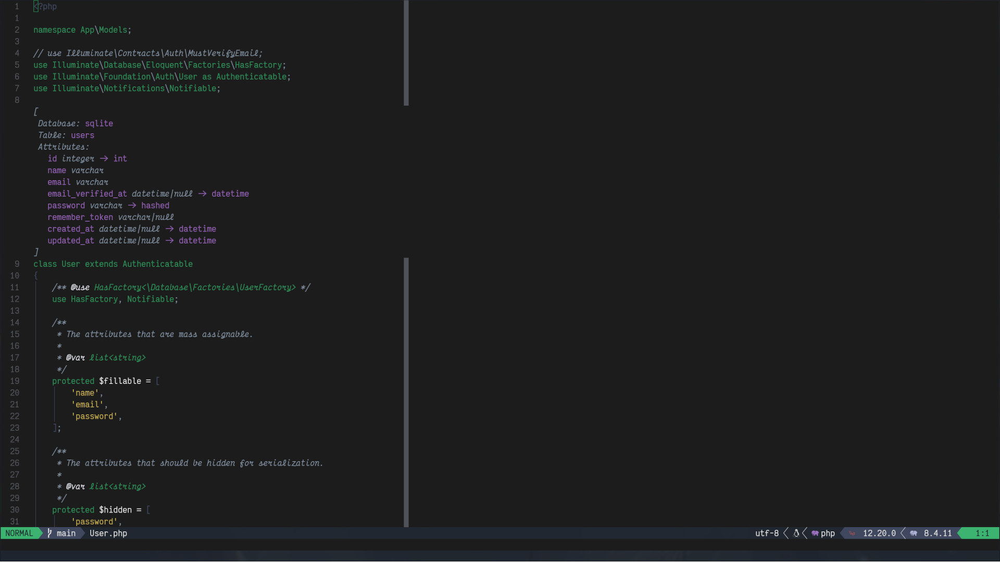
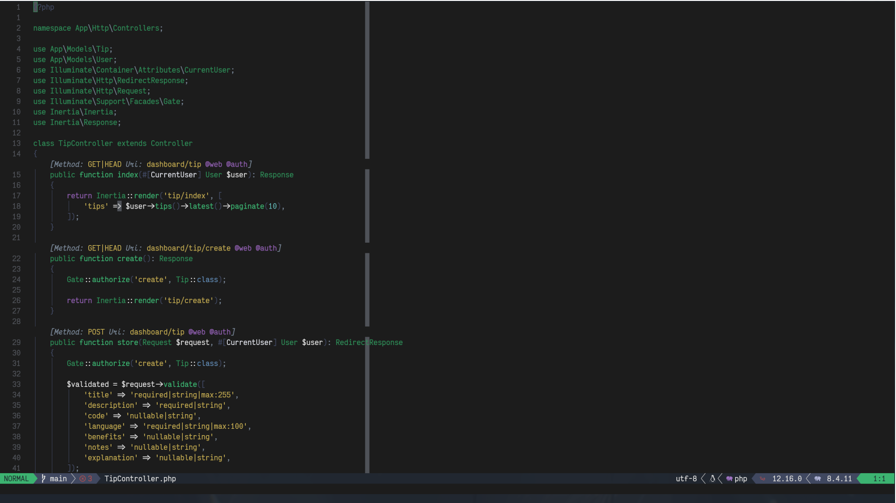
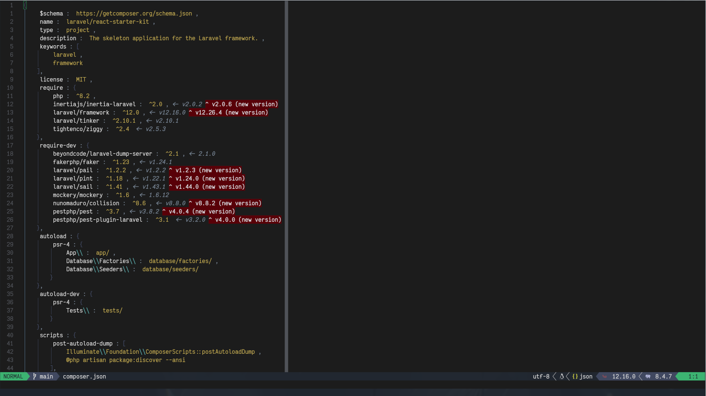
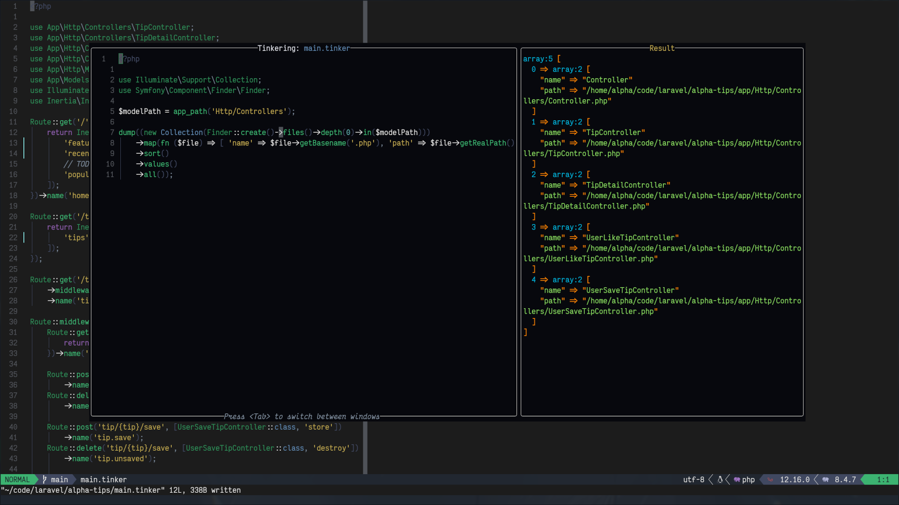
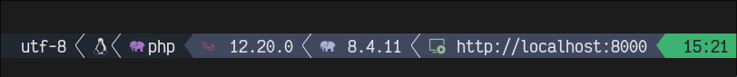

Plugin for Neovim to enhance the development experience of Laravel projects


# ✨ Features

## Environment
The plugin supports different types of environment, like local, sail, docker compose and heard, and can be extended for your own need.
To get you all the power and some flexibility the plugin will store your preferences in your machine per projects.
By default will use base on your configurations the `environments.default` which on the plugin is local, this is just for initial opening and can be easily modified. You can change de default during the setup, and in case you need a different in the project just use `:lua Laravel.commands.run("env:configure")` to launch the environment selector, and in case you have a more complex configuration from the defaults you can run `:lua Laravel.commands.run("env:configure:open")`  to open the json file and edit as you may need to map commands. An example could be change the name of the container in a particular project from the default app to what ever you may need. This gives you more control over the execution since the plugin relies on the real commands to gather information.

#### Important
Ensure that you vendor folder is writeable since the plugin will create files there in order to execute code and cache it properly for improved speed.

## Pickers
- Artisan commands
- Routes
- User Commands, allow you to define your own quick actions
- Makes
- Resources, picker sort by common laravel resources like controlles migrations, etc.
- Related, on a model quickly go to relations of it.
- Composer
- History, the plugin stores the previously run commands to quicly re-run them.



## Virtual Information
- Model Info: Get the model information like database, table and fields, directly on the model
- Route Info: Get the URI, method and middlewares right on top of your controller function
- Composer Info: Get the exact version of the installed packages and if an update is available.




## Completion
The plugin offers completion for several elements of the code like
- routes
- views (blade)
- config keys
- environment variables (from .env)
- model columns

The completion is written for cmp, and is register with the name `laravel` so it can be added
to your config.

For blink you can use [compat](https://github.com/Saghen/blink.compat)
```lua
laravel = {
    name = "laravel",
    module = "blink.compat.source",
    score_offset = 95, -- show at a higher priority than lsp
},
```

## Actions
The plugin provides an action system like the lsp action, but only for laravel.

## Tinker
Tinker it's a great tool, the plugins provides a new way to interact with it.
Using files .tinker on your project and a dedicated UI makes interact with Tinker
a lot easier and fun.


## Hub
Hub is my solution to run different commands easily.
using `Laravel.commands.run("hub")` will open the new ui and will default with common commands to run
in the predefined environment.

## Eloquent Completion.
In order to have the best experience with laravel eloquent now the plugin can generate a custom class in the vendor folder
with all the fields for the model and methods.
Since this do not modified your model is enable by default, if you don't want that you can disable the property `eloquent_generate_doc_blocks` from the root of the plugin config.
In some projects the generation can be big so recommended is to expand the lsp maxSize to the current 1MB.
```lua
 vim.lsp.config('intelephense', {
     ...
      settings = {
        intelephense = {
          files = {
            maxSize = 2000000,
          },
        },
      }
```

## Lualine Integration

<details>
    <summary>items configurations</summary>

```lua
{
  {
    function()
      local ok, laravel_version = pcall(function()
        return Laravel.app("status"):get("laravel")
      end)
      if ok then
        return laravel_version
      end
    end,
    icon = { " ", color = { fg = "#F55247" } },
    cond = function()
      local ok, has_laravel_versions = pcall(function()
        return Laravel.app("status"):has("laravel")
      end)
      return ok and has_laravel_versions
    end,
  },
  {
    function()
      local ok, php_version = pcall(function()
        return Laravel.app("status"):get("php")
      end)
      if ok then
        return php_version
      end
      return nil
    end,
    icon = { " ", color = { fg = "#AEB2D5" } },
    cond = function()
      local ok, has_php_version = pcall(function()
        return Laravel.app("status"):has("php")
      end)
      return ok and has_php_version
    end,
  },
}
```
</details>

# 📦 Installation

Using [Lazy.nvim](https://github.com/folke/lazy.nvim)
```lua
{
  "adalessa/laravel.nvim",
  dependencies = {
    "MunifTanjim/nui.nvim",
    "nvim-lua/plenary.nvim",
    "nvim-neotest/nvim-nio",
  },
  ft = { "php", "blade" },
  event = {
    "BufEnter composer.json",
  },
  keys = {
    { "<leader>ll", function() Laravel.pickers.laravel() end,              desc = "Laravel: Open Laravel Picker" },
    { "<c-g>",      function() Laravel.commands.run("view:finder") end,    desc = "Laravel: Open View Finder" },
    { "<leader>la", function() Laravel.pickers.artisan() end,              desc = "Laravel: Open Artisan Picker" },
    { "<leader>lt", function() Laravel.commands.run("actions") end,        desc = "Laravel: Open Actions Picker" },
    { "<leader>lr", function() Laravel.pickers.routes() end,               desc = "Laravel: Open Routes Picker" },
    { "<leader>lh", function() Laravel.run("artisan docs") end,            desc = "Laravel: Open Documentation" },
    { "<leader>lm", function() Laravel.pickers.make() end,                 desc = "Laravel: Open Make Picker" },
    { "<leader>lc", function() Laravel.pickers.commands() end,             desc = "Laravel: Open Commands Picker" },
    { "<leader>lo", function() Laravel.pickers.resources() end,            desc = "Laravel: Open Resources Picker" },
    { "<leader>lp", function() Laravel.commands.run("command_center") end, desc = "Laravel: Open Command Center" },
    { "<leader>lu", function() Laravel.commands.run("hub") end,            desc = "Laravel Artisan hub" },
    {
      "gf",
      function()
        local ok, res = pcall(function()
          if Laravel.app("gf").cursorOnResource() then
            return "<cmd>lua Laravel.commands.run('gf')<cr>"
          end
        end)
        if not ok or not res then
          return "gf"
        end
        return res
      end,
      expr = true,
      noremap = true,
    },
  },
  opts = {
    features = {
      pickers = {
        provider = "snacks", -- "snacks | telescope | fzf-lua | ui-select"
      },
    },
  },
}
```

## Using `vim.pack` (Neovim 0.11+ built-in package manager)

Add to your plugin specs (e.g., `lua/plugins/specs.lua`):
```lua
local gh = function(repo)
  return "https://github.com/" .. repo
end

return {
  -- dependencies
  { src = gh("MunifTanjim/nui.nvim") },
  { src = gh("nvim-lua/plenary.nvim") },
  { src = gh("nvim-neotest/nvim-nio") },
  -- laravel.nvim
  { src = gh("adalessa/laravel.nvim") },
}
```

Then bootstrap in your `init.lua`:
```lua
vim.pack.add(require("plugins.specs"))
```

Then create your setup file (e.g., `lua/plugins/setup/laravel.lua`):
```lua
local laravel = require("laravel")

laravel.setup({
  features = {
    pickers = {
      provider = "telescope", -- or "snacks" | "fzf-lua" | "ui-select"
    },
  },
})

vim.g.Laravel = laravel

local function map(lhs, fn, desc)
  vim.keymap.set("n", lhs, fn, { desc = desc })
end

map("<leader>ll", function() Laravel.pickers.laravel() end, "Laravel: Open Laravel Picker")
map("<leader>la", function() Laravel.pickers.artisan() end, "Laravel: Open Artisan Picker")
map("<leader>lr", function() Laravel.pickers.routes() end, "Laravel: Open Routes Picker")
map("<leader>lm", function() Laravel.pickers.make() end, "Laravel: Open Make Picker")
map("<leader>lc", function() Laravel.pickers.commands() end, "Laravel: Open Commands Picker")
map("<leader>lo", function() Laravel.pickers.resources() end, "Laravel: Open Resources Picker")
map("<leader>lt", function() Laravel.commands.run("actions") end, "Laravel: Open Actions Picker")
map("<leader>lu", function() Laravel.commands.run("hub") end, "Laravel Artisan hub")
map("<leader>lh", function() Laravel.run("artisan docs") end, "Laravel: Open Documentation")
map("<c-g>", function() Laravel.commands.run("view:finder") end, "Laravel: Open View Finder")
map("<leader>lp", function() Laravel.commands.run("command_center") end, "Laravel: Open Command Center")

map("gf", function()
  local ok, res = pcall(function()
    if Laravel.app("gf").cursorOnResource() then
      return "<cmd>lua Laravel.commands.run('gf')<cr>"
    end
  end)
  if not ok or not res then
    return "gf"
  end
  return res
end, "Laravel: Go to resource", { expr = true, noremap = true })
```

## Configuration
The configuration is extense and recommend look [here](lua/laravel/options/default.lua)

# Self promotion
I am Ariel I am a developer and also content creator (mostly in Spanish)
if you would like to show some love leave a start into the plugin and subscribe to my [Youtube](https://youtube.com/@Alpha_Dev)
if you want to show even more love you can support becoming a member on Youtube.
But just leaving a like or letting me know that you like and enjoy the plugin is appreciated.

# Collaboration
I am open to review pr if you have ideas or ways to improve the plugin would be great.
