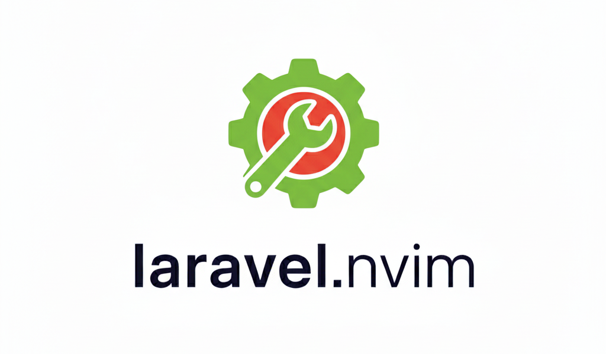
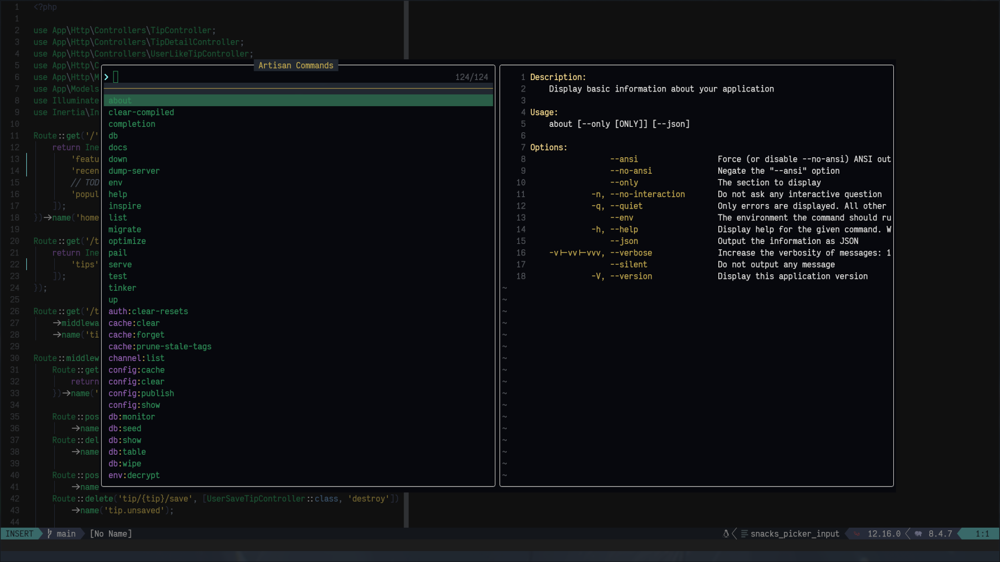
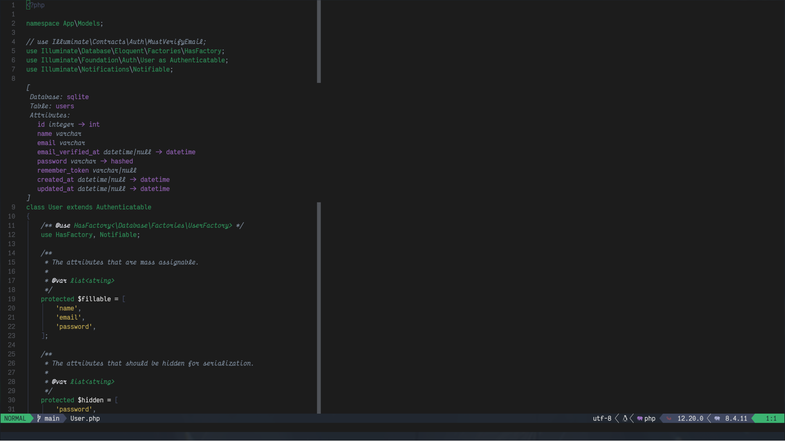
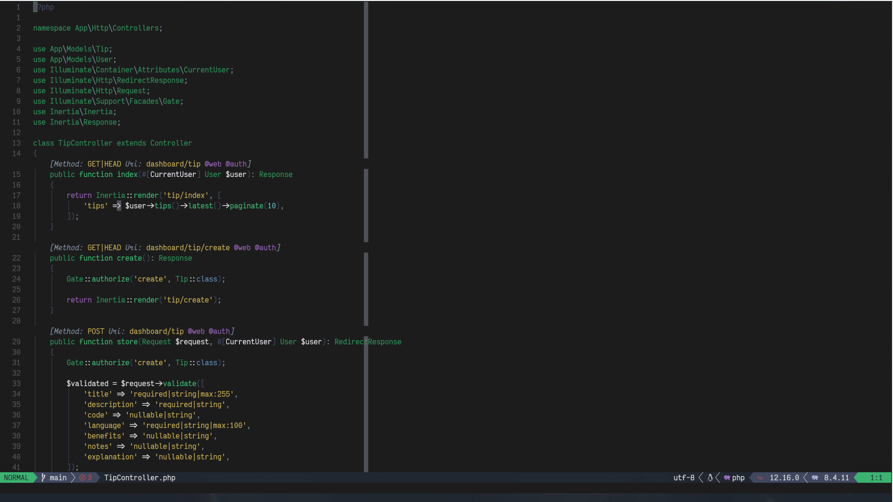
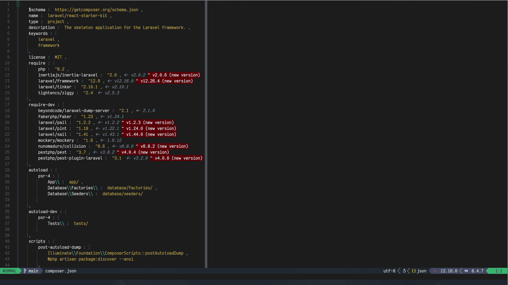
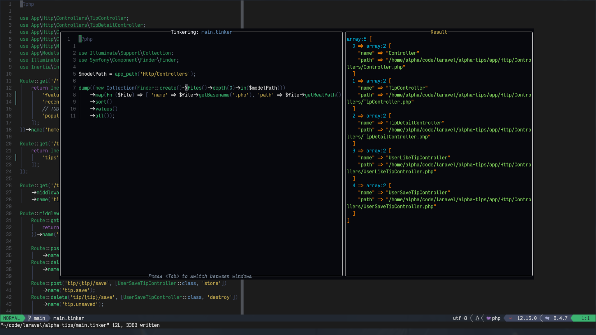
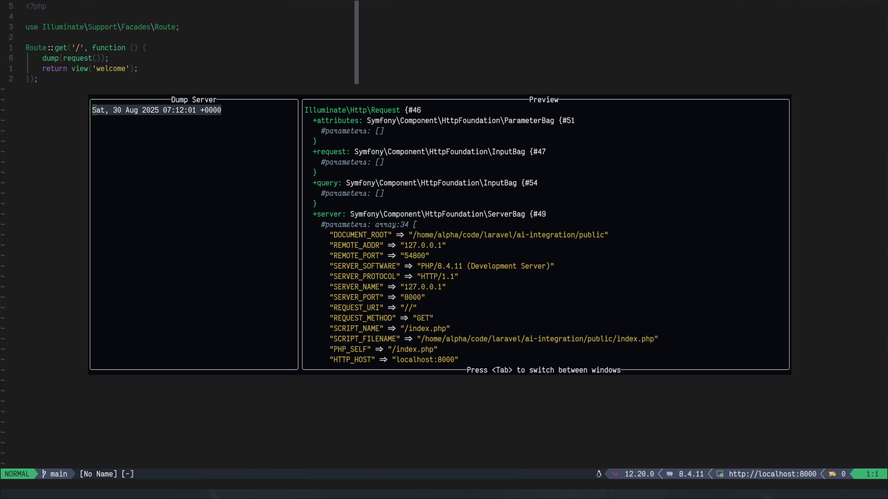
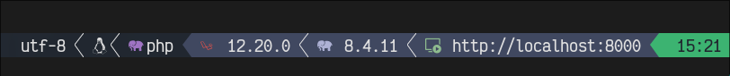

Plugin for Neovim to enhance the development experience of Laravel projects


# ✨ Features

## Environment
The plugin supports different types of environment, like local, sail, docker compose and heard, and can be extended for your own need

## Pickers
- Artisan commands
- Routes
- User Commands, allow you to define your own quick actions
- Makes
- Resources, picker sort by common laravel resources like controlles migrations, etc.
- Related, on a model quickly go to relations of it.
- Composer
- History, the plugin stores the previously run commands to quicly re-run them.



## Virtual Information
- Model Info: Get the model information like database, table and fields, directly on the model
- Route Info: Get the URI, method and middlewares right on top of your controller function
- Composer Info: Get the exact version of the installed packages and if an update is available.




## Actions
The plugin provides an action system like the lsp action, but only for laravel.

## Tinker
Tinker it's a great tool, the plugins provides a new way to interact with it.
Using files .tinker on your project and a dedicated UI makes interact with Tinker
a lot easier and fun.


## Dump Server
Integration with [laravel dump server](https://github.com/beyondcode/laravel-dump-server)


## Dev Server
One of the ways to run your laravel environment is locally using `artisan serve`.
For this type of user laravel now ships with a command in composer called `dev`
If you are one of this users you can start the server directly from neovim.


## Lualine Integration

<details>
    <summary>items configurations</summary>

```lua
{
  {
    function()
      local ok, laravel_version = pcall(function()
        return Laravel.app("status"):get("laravel")
      end)
      if ok then
        return laravel_version
      end
    end,
    icon = { " ", color = { fg = "#F55247" } },
    cond = function()
      local ok, has_laravel_versions = pcall(function()
        return Laravel.app("status"):has("laravel")
      end)
      return ok and has_laravel_versions
    end,
  },
  {
    function()
      local ok, php_version = pcall(function()
        return Laravel.app("status"):get("php")
      end)
      if ok then
        return php_version
      end
      return nil
    end,
    icon = { " ", color = { fg = "#AEB2D5" } },
    cond = function()
      local ok, has_php_version = pcall(function()
        return Laravel.app("status"):has("php")
      end)
      return ok and has_php_version
    end,
  },
  {
    function()
      local ok, hostname = pcall(function()
        return Laravel.extensions.composer_dev.hostname()
      end)
      if ok then
        return hostname
      end
      return nil
    end,
    icon = { " ", color = { fg = "#8FBC8F" } },
    cond = function()
      local ok, is_running = pcall(function()
        return Laravel.extensions.composer_dev.isRunning()
      end)
      return ok and is_running
    end,
  },
  {
    function()
      local ok, unseen_records = pcall(function()
        return #(Laravel.extensions.dump_server.unseenRecords())
      end)

      if ok then
        return unseen_records
      end
      return 0
    end,
    icon = { "󰱧 ", color = { fg = "#FFCC66" } },
    cond = function()
      local ok, is_running = pcall(function()
        return Laravel.extensions.dump_server.isRunning()
      end)

      return ok and is_running
    end,
  },
}
```
</details>

# 📦 Installation

Using [Lazy.nvim](https://github.com/foke/lazy.nvim)
```lua
{
  "adalessa/laravel.nvim",
  dependencies = {
    "tpope/vim-dotenv",
    "MunifTanjim/nui.nvim",
    "nvim-lua/plenary.nvim",
    "nvim-neotest/nvim-nio",
    "ravitemer/mcphub.nvim", -- optional
  },
  cmd = { "Laravel" },
  keys = {
    { "<leader>ll", function() Laravel.pickers.laravel() end,              desc = "Laravel: Open Laravel Picker" },
    { "<c-g>",      function() Laravel.commands.run("view:finder") end,    desc = "Laravel: Open View Finder" },
    { "<leader>la", function() Laravel.pickers.artisan() end,              desc = "Laravel: Open Artisan Picker" },
    { "<leader>lt", function() Laravel.commands.run("actions") end,        desc = "Laravel: Open Actions Picker" },
    { "<leader>lr", function() Laravel.pickers.routes() end,               desc = "Laravel: Open Routes Picker" },
    { "<leader>lh", function() Laravel.run("artisan docs") end,            desc = "Laravel: Open Documentation" },
    { "<leader>lm", function() Laravel.pickers.make() end,                 desc = "Laravel: Open Make Picker" },
    { "<leader>lc", function() Laravel.pickers.commands() end,             desc = "Laravel: Open Commands Picker" },
    { "<leader>lo", function() Laravel.pickers.resources() end,            desc = "Laravel: Open Resources Picker" },
    { "<leader>lp", function() Laravel.commands.run("command_center") end, desc = "Laravel: Open Command Center" },
    {
      "gf",
      function()
        local ok, res = pcall(function()
          if Laravel.app("gf").cursorOnResource() then
            return "<cmd>lua Laravel.commands.run('gf')<cr>"
          end
        end)
        if not ok or not res then
          return "gf"
        end
        return res
      end,
      expr = true,
      noremap = true,
    },
  },
  event = { "VeryLazy" },
  opts = {
    lsp_server = "phpactor", -- "phpactor | intelephense"
    features = {
      pickers = {
        provider = "snacks", -- "snacks | telescope | fzf-lua | ui-select"
      },
    },
  },
}
```

## Configuration
The configuration is extense and recommend look [here](lua/laravel/options/default.lua)

# Self promotion
I am Ariel I am a developer and also content creator (mostly in Spanish)
if you would like to show some love leave a start into the plugin and subscribe to my [Youtube](https://youtube.com/@Alpha_Dev)
if you want to show even more love you can support becoming a member on Youtube.
But just leaving a like or letting me know that you like and enjoy the plugin is appreciated.

# Collaboration
I am open to review pr if you have ideas or ways to improve the plugin would be great.
